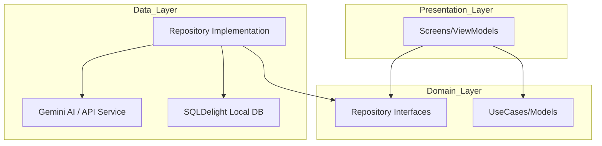

# Pusaka Kata: Petualangan Kosakata & Mitologi Nusantara


**Pusaka Kata** adalah aplikasi edukasi interaktif berbasis **Kotlin Multiplatform (KMP)** yang dirancang untuk memperkaya penguasaan kosakata baku, puitis, dan arkais Indonesia melalui bantuan AI dan gamifikasi mitologi Nusantara. (Updated by Eka)

---

## 👥 Tim Pengembang
* **Muharyan Syaifullah** (123140045) - Lead Developer & Architecture
* **Eka Putri Azhari Ritonga** (123140028) - UI/UX Designer & Developer

---

## ✨ Fitur Utama
1. 🧠 **Smart Flashcard (SRS):** Hafalan kosakata menggunakan **Algoritma SM-2 (SuperMemo-2)** yang menghitung jadwal review secara adaptif.
2. ✨ **Asisten AI (Gemini Flash):** Integrasi kecerdasan buatan untuk definisi otomatis, klasifikasi kategori, dan generator kalimat.
3. 🎲 **Sistem Gacha Kartu Pusaka:** Koleksi kartu karakter legendaris Nusantara (Gajah Mada, Nyi Roro Kidul, dll).
4. 🏺 **Galeri Mitologi:** Melacak koleksi kartu legenda yang telah didapatkan dan membaca kisah lengkapnya.
5. 📝 **Kuis Pintar:** Melatih ingatan kosa kata dan mendapatkan reward token.
6. ❤️ **Favorit:** Tandai kosakata pusaka yang paling kamu sukai.
7. 📴 **Dukungan Offline:** Database lokal SQLDelight dengan data awal yang siap digunakan tanpa internet.
8. 🌙 **Mode Gelap/Terang:** Mendukung preferensi tema sistem secara otomatis atau pilihan manual yang tersimpan (*persistent*).
9. 📱 **Navigasi Swipe:** Pengalaman navigasi modern antar tab utama menggunakan gestur geser.

---

## 🛠️ Tech Stack & Arsitektur
Aplikasi ini menggunakan standar **Modern Android Development**:
* **Language:** Kotlin 2.0+ (Semantic Versioning 1.0.0)
* **Framework:** Compose Multiplatform
* **Architecture:** Clean Architecture (Domain, Data, Presentation)
* **DI:** Koin
* **Networking:** Ktor Client 2.3.12
* **Local DB:** SQLDelight 2.0.2
* **AI Engine:** Google Gemini AI

### Diagram Arsitektur


---

## 📂 Struktur Proyek
```text
composeApp/src/commonMain/kotlin/id/pusakakata/
├── core/           # Utility, Networking, & DI Base Setup
├── data/           # Repository implementations & Local/Remote sources
├── domain/         # Models, Repository Interfaces, & UseCases
├── di/             # Koin Dependency Injection
└── presentation/   # UI Layer (Screens, ViewModels, Components, Theme)
```

---

## 🧪 Pengujian (Testing)
Aplikasi ini memiliki cakupan pengujian yang luas (>70% coverage):
- **Unit Tests (25+ test):** Mencakup semua ViewModel dan logika Bisnis (SRS, Gacha).
- **UI Tests (3 test):** Menguji alur navigasi utama pada Android.

### Cara Menjalankan Test:
1. **Unit Test:** `./gradlew testDebugUnitTest`
2. **UI Test:** `./gradlew connectedAndroidTest`

### Screenshot Coverage


---

## 📦 Build & Release
### Cara Build APK Release:
1. Pastikan `GEMINI_API_KEY` sudah ada di `local.properties`.
2. Jalankan perintah: `./gradlew assembleRelease`
3. APK akan berada di `composeApp/build/outputs/apk/release/`.

---

## 🚀 Cara Menjalankan
### Prasyarat
- Android Studio Ladybug (2024.2.1) atau versi terbaru.
- JDK 17 atau 21.

### Langkah-langkah
1. **Clone Repository:**
   ```bash
   git clone https://github.com/MuharyanSyaifullah/Proyek-Pengembangan-Aplikasi-Mobile.git
   ```
2. **Setup API Key:**
   - Salin file `local.properties.example` menjadi `local.properties`.
   - Masukkan `GEMINI_API_KEY` Anda dari [Google AI Studio](https://aistudio.google.com/).
3. **Sync Gradle:** Tunggu hingga proses sinkronisasi selesai.
4. **Jalankan Aplikasi:** Pilih modul `composeApp` dan jalankan pada emulator atau perangkat fisik.

---

## 🛠️ Pengembangan
Kami menggunakan alur kerja berbasis branch dan commit convention yang ketat. Silakan baca **[CONTRIBUTING.md](./CONTRIBUTING.md)** untuk panduan lebih lanjut.

## 📄 Lisensi
Proyek ini dibuat untuk memenuhi tugas mata kuliah Pengembangan Aplikasi Mobile.
