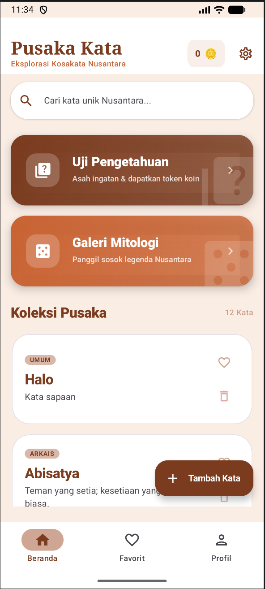
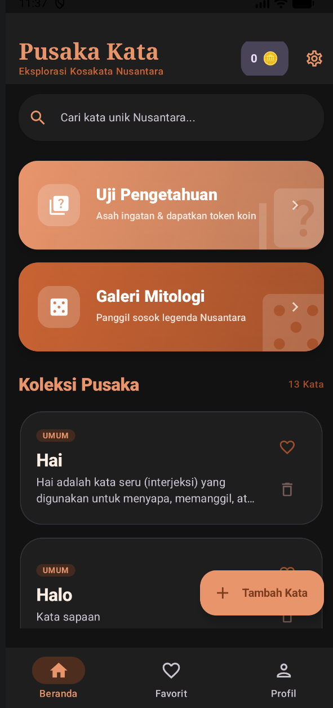
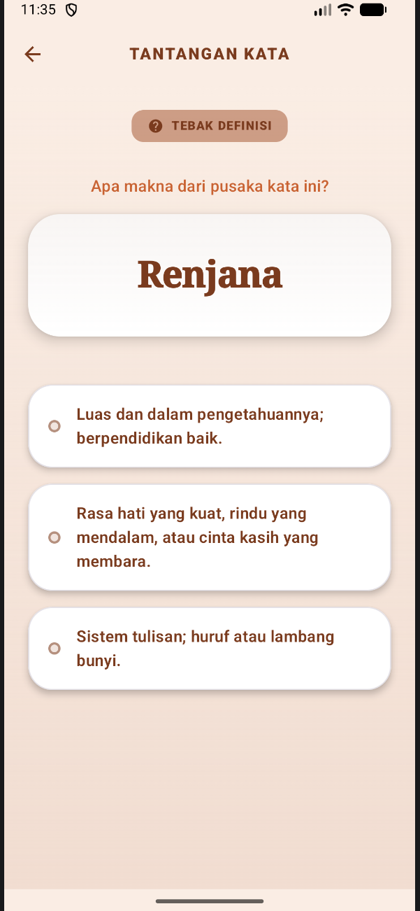
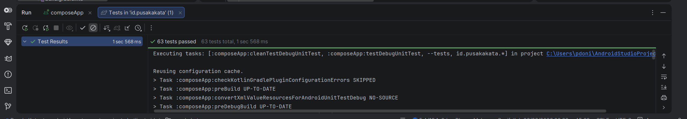
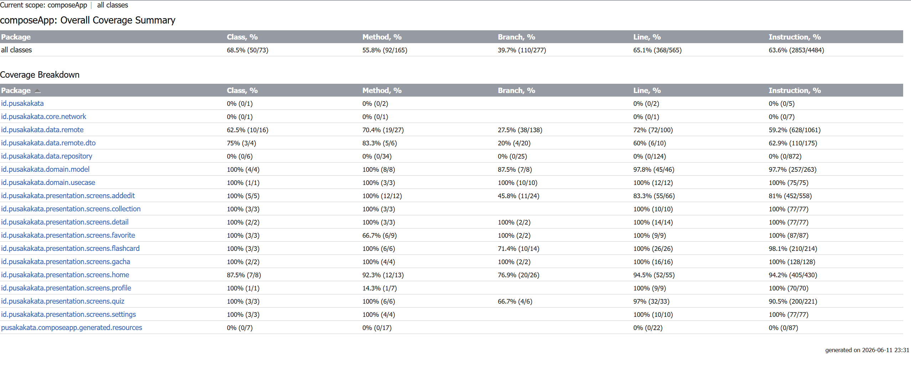

# Pusaka Kata: Petualangan Kosakata & Mitologi Nusantara

**Pusaka Kata** adalah aplikasi edukasi interaktif berbasis **Kotlin Multiplatform (KMP)** yang dirancang untuk memperkaya penguasaan kosakata baku, puitis, dan arkais Indonesia melalui bantuan AI dan gamifikasi mitologi Nusantara.

---

## 📺 Demo Video
Tonton video demonstrasi fitur aplikasi di YouTube:
**[Link Demo Video - Pusaka Kata](https://youtu.be/Xcc-2lv829U)**

---

## 👥 Tim Pengembang
* **Muharyan Syaifullah** (123140045) - Lead Developer & Architecture
* **Eka Putri Azhari Ritonga** (123140028) - UI/UX Designer & Developer

---

## ✨ Fitur Utama
1. 🧠 **Smart Flashcard (SRS):** Hafalan kosakata menggunakan **Algoritma SM-2 (SuperMemo-2)** yang menghitung jadwal review secara adaptif.
2. ✨ **Asisten AI (Gemini Flash):** Integrasi kecerdasan buatan untuk definisi otomatis, klasifikasi kategori, dan generator kalimat.
3. 🎲 **Sistem Gacha Kartu Pusaka:** Koleksi kartu karakter legendaris Nusantara (Gajah Mada, Nyi Roro Kidul, dll).
4. 🏺 **Galeri Mitologi:** Melacak koleksi kartu legenda yang telah didapatkan dan membaca kisah lengkapnya.
5. 📝 **Kuis Pintar:** Melatih ingatan kosa kata dan mendapatkan reward token koin.
6. ❤️ **Favorit:** Tandai kosakata pusaka yang paling kamu sukai agar mudah diakses.
7. 📴 **Dukungan Offline:** Database lokal SQLDelight dengan data awal yang siap digunakan tanpa internet.
8. 🌙 **Mode Gelap/Terang:** Mendukung preferensi tema sistem secara otomatis atau pilihan manual yang tersimpan.

---

## 📸 Preview Aplikasi

### 🏠 Beranda & Eksplorasi
| Beranda (Light) | Beranda (Dark) | Detail Kata |
|:---:|:---:|:---:|
|  |  |  |

### 🤖 Fitur AI & Manajemen Kata
| Hasil Pencarian AI | Edit Kata | Favorit |
|:---:|:---:|:---:|
|  |  |  |

### 📝 Kuis & Gamifikasi
| Tampilan Kuis | Jawaban Benar (+1 🪙) | Jawaban Salah |
|:---:|:---:|:---:|
|  |  |  |

### 🎲 Galeri Mitologi (Gacha)
| Persiapan Panggil | Animasi Pemanggilan | Hasil Legenda | Kisah Lengkap |
|:---:|:---:|:---:|:---:|
|  |  |  |  |

---

## 🛠️ Tech Stack & Arsitektur
Aplikasi ini dibangun dengan standar **Modern Android Development**:
* **Language:** Kotlin 2.0+
* **Framework:** Compose Multiplatform (KMP)
* **Architecture:** Clean Architecture (Domain, Data, Presentation)
* **DI:** Koin
* **Networking:** Ktor Client
* **Local DB:** SQLDelight
* **AI Engine:** Google Gemini AI

### Screenshot Teknis
| Struktur Projek (Clean Arch) | Unit Testing (63 Passed) | Coverage Report (65.1%) |
|:---:|:---:|:---:|
|  |  |  |

---

## 🚀 Cara Menjalankan
1. **Setup API Key:** Masukkan `GEMINI_API_KEY` di file `local.properties`.
2. **Sync Gradle:** Tunggu hingga proses sinkronisasi selesai.
3. **Run:** Pilih modul `composeApp` dan jalankan pada emulator atau perangkat Android.

---

## 📄 Tentang Aplikasi
Dibuat oleh **Muharyan Syaifullah** dan **Eka Putri Azhari** untuk memenuhi tugas mata kuliah Pengembangan Aplikasi Mobile (IF25-22017) - Institut Teknologi Sumatera.

**Dibuat oleh Kelompok Kicaw Mania**
